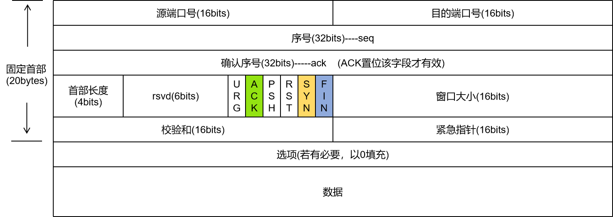
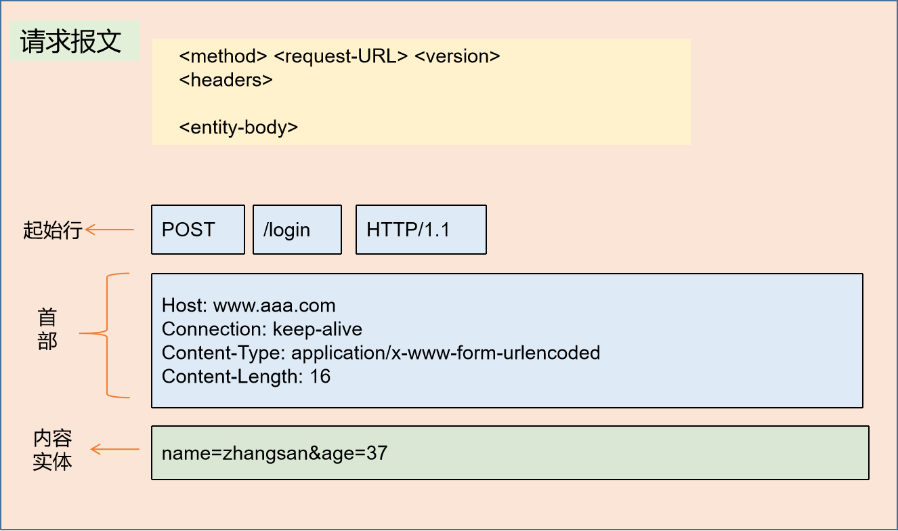
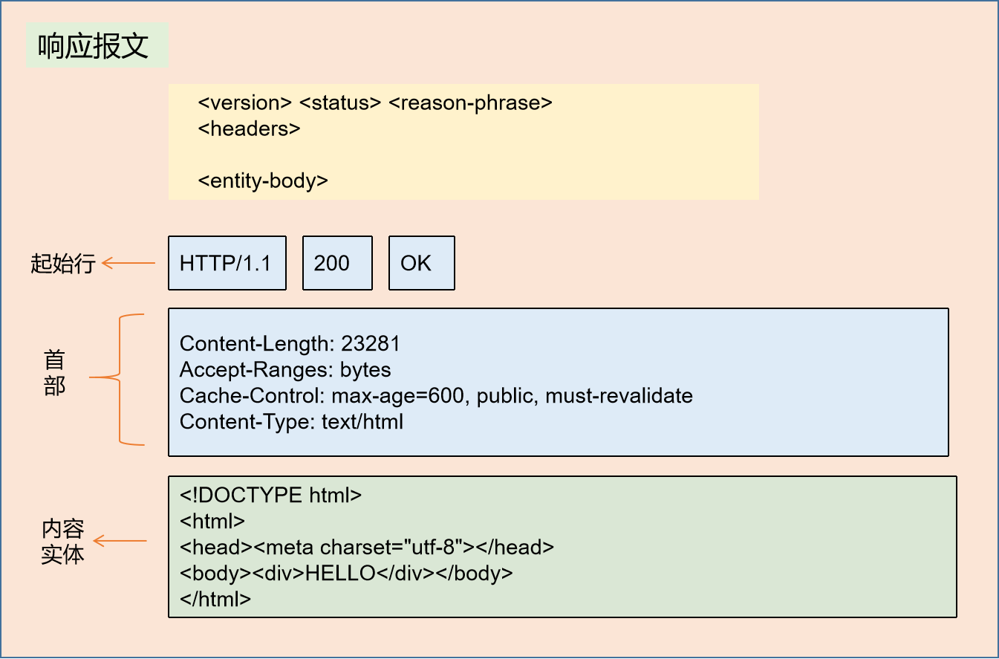
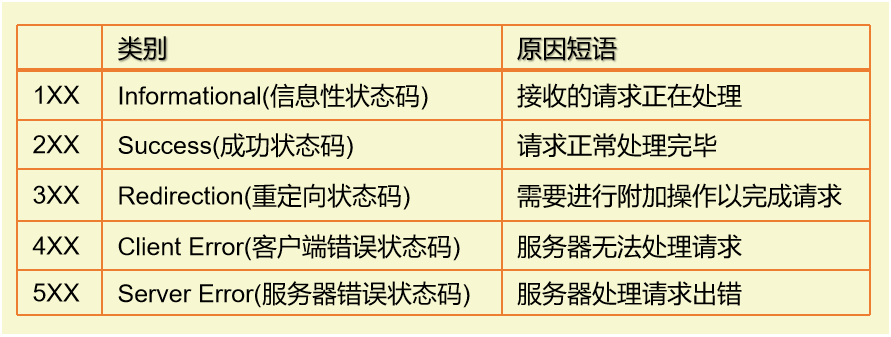

# HTTP知识点记录

《图解HTTP》阅读纪要

## <a name="catalog">目录</a>

##### 1. [网络模型与TCP协议](#One)
##### 2. [HTTP报文格式及常见HTTP方法](#Two)
##### 3. [HTTP的状态码](#Three)
##### 4. [HTTP的缓存控制](#Four)
##### 5. [HTTPS的核心SSL/TLS运行机制](#Five)

<br>

## 1. <a name="One">网络模型与TCP协议</a>
#### 1.1 URL 和 URI
客户端是指通过发送请求获取服务器资源的 Web 浏览器等程序。 Web 使用 HTTP (HyperText Transfer Protocol，超文本传输协议)作为规范，完成客户端和浏览器之间的通信。

我们在使用 Web 浏览器访问 Web 等页面时输入的网页地址，就是 URL。 URL叫做统一资源定位符(Uniform Resource Locator)。另外，还有一种URI(Uniform Resource Identifier，统一资源标识符), 是指由某种协议方案表示的资源的标识符，此处协议方案是指 HTTP、 ftp、 mailto、telnet、 file 等协议类型的名称。可见，URI 是用字符串标识某一互联网资源，而 URL 表示资源在互联网上所处的位置，可见 URL 是 URI 的子集。

```
  // URI 示例
  ftp://ftp.is.co.za/rfc/rfc1808.txt <br>
  mailto://John.Doe@example.com
  http://www.itef.org/rfc/rfc2396.txt
```

#### 1.2 OSI七层模型及TCP/IP四层模型

##### 1.2.1 OSI 七层模型：
OSI 七层模型由上到下分别为：
* 应用层
* 表示层
* 会话层
* 传输层
* 网络层
* 数据链路层
* 物理层

##### 1.2.2. TCP/IP四层模型
TCP/IP 协议则进行了简化，包含如下四层：
* **应用层** ： 把需要通过网络传输的**数据**按照特定的标准协议的格式进行编码。 一个进程对应一个端口号。 应用层使用如下基于传输层协议TCP或UDP的协议之一：
	* 基于TCP的协议：
		1. **HTTP** (默认80端口)：主要用于普通浏览
		2. **HTTPS** (443端口)： HTTP协议的安全版本
		3. **FTP** (20和21端口)：用于文件传输
		4. **POP3**(110端口)： 用于接收邮件
		5. **SMTP** (25端口)： 用于发送邮件
		6. **TELNET** (23端口)： 用于通过一个终端登录到网络
		7. **SSH** (22端口)： 用于替代安全性差的TELNET, 可以加密安全登录
	* 基于UDP的协议：
		1. **DHCP** (67端口，动态主机配置协议): 用于动态配置IP地址
	* 其他
		1. **DNS**：运行在TCP和UDP之上，用于完成地址查找，邮件转发等工作。
* **传输层**：建立应用程序用于特定任务数据交换的基本数据通道，提供端到端的消息传输服务。

* **网络层**：负责通过潜在的多个网络发送数据包，从源网络发送数据到目的网络的过程，叫做路由。网络层协议提供两个基本的功能：
	* 主机寻址和识别：由 `分层IP寻址系统` 完成 
	* 数据包路由： 将数据包转发到靠近目的地的下一个网络路由器。

* **数据链路层**：用于在同一链路不同主机的网络层接口之间移动数据包。


#### 1.3 传输层TCP协议
TCP (Transmission Control Protocol，传输控制协议)是一种面向连接的、可靠的、基于字节流的传输层通信协议。

##### 1.3.1 TCP的三次握手和四次挥手

* 三次握手
	* 客户端发送SYN报文(seq=x)请求建立连接，进入SYN_SEND状态
	* 服务器收到SYN报文，回ACK报文(ack=x+1)表示确认，同时发送SYN报文(seq=y)，进入SYN_RECV状态
	* 客户端收到服务器的SYN，回ACK报文(ack=y+1，seq=x+1)表示确认 ，进入Established状态 ，服务器在收到ACK报文后 ，也进入Established状态。

* 四次挥手
	* 客户端发送一个 FIN ， 告诉服务器想关闭连接
	* 服务器收到这个 FIN， 发回一个 ACK
	* 服务器通知应用程序关闭网络连接，应用程序关闭后通知服务器，服务器发送一个FIN 给客户端，通知连接已关闭。
	* 客户端发回 ACK报文确认。

之所以断开连接需要四步，是因为建立连接时，服务器可以把ACK和SYN一起回复，但是在断开连接时，服务器立马回了ACK，但是需要等待应用程序关闭网络连接后才可以发送FIN，这样ACK和FIN分开发送，就多了一个步骤。

##### 1.3.2 TCP报文格式

tcp 报文格式如下：
<div align="center">
  
</div>


* **序号 seq**
  1. SYN 置1，则为初始的序号；
  2. SYN 清0，则为当前会话的累加序号。

* **确认序号 ack**

　　如果ACK置1，则该值为 ACK报文发送者所期望的下一个 **序号**，表示确认收到之前的字节，每端发送的第一个ACK确认另一端的初始序号。

* **首部长度**

　　单位是4字节，最小为5，最大为15。即首部最少20字节，最多60字节。

* **ACK**

　　置位表明确认序号字段有效。客户端在初始的SYN包之后的所有包都必须将这个标志位置位。

* **SYN**

　　置位表明是发送端的第一个包。在建立连接时使用，用于同步序号。当 SYN=1，ACK=0 时，表示是请求建立连接的报文，当 SYN=1,ACK=1 时，表明对方同意建立连接，只有前两次握手中SYN才置1.

* **FIN**

　　置位表明是发送端的最后一个包。


<br>[Top](#catalog)

## 2. <a name="Two">HTTP报文格式及常见HTTP方法</a>

#### 2.1 应用层协议HTTP
HTTP协议主要是规定了客户端和服务器之间的通信格式，默认使用80端口。

##### 2.1.1 请求报文的格式
请求报文是由请求方法、请求URI、协议版本、可选的请求首部字段和内容实体构成。
<div align="center">
  
</div>

##### 2.1.2 响应报文的格式
响应报文由协议版本、状态码、用以解释状态码的原因短语，可选的响应首部字段以及实体内容构成。

<div align="center">
  
</div>

#### 2.2 常见的HTTP方法

* **GET** ： 获取资源
* **POST** ： 传输实体主体
* **PUT** ： 传输文件，用于将请求报文的主体中包含的文件内容，保存到请求URL指定的位置，无验证机制。
* **HEAD** ： 获取报文首部，和GET一样，只是不返回报文主体，用于确认URI的有效性及资源更新的日期时间等。
* **DELETE** ： 用于删除请求URL指定的文件，与PUT相反。 无验证机制。
* **OPTIONS** ： 用于查询针对请求URL指定的资源所支持的方法
* **CONNECT** ：要求在与代理服务器通信时建立隧道，实现用隧道协议进行 TCP 通信，主要使用 SSL 和 TLS 协议把通信内容加密后经网络隧道传输。
* **PATCH** ： 用于对资源进行部分修改。


<details>
  <summary> OPTIONS 使用示例</summary>

```js
 //请求
 OPTIONS * HTTP/1.1
 Host: www.aaa.com
 //响应
 HTTP/1.1 200 OK
 Allow:GET,POST,HEAD,OPTIONS
```  
</details>

#### 2.3 HTTP的状态管理
HTTP是不保存状态的协议，也就是说，不会保留之前一切请求或响应报文的信息，但是随着业务的发展，无状态处理复杂业务比较麻烦，比如用户登录了一个网站，此时想要购物结算，跳到其他商品页或者结算页时都期望能有用户的登录信息，为此引入了Cookie技术。

Cookie 会在服务器的第一个响应报文中通过设置首部字段 Set-Cookie 的值(SessionID)，通知客户端保存 Cookie，当客户端下次再发送请求时，会在请求头中带上包含 SessionID 的 Cookie 字段，服务器收到后，就可以对比自己的记录，得到之前的状态信息。

#### 2.4 如何实现一个简易静态服务器

* 导入http模块，创建一个服务器，并监听端口
* 服务器听到请求时，进行处理，需要根据不同的 方法/path 去执行不同的处理逻辑，获取数据，响应给客户端
* 客户端的浏览器收到响应数据后，会把响应体中的数据按照指定格式展示出来。

<details>
	<summary> 代码示例 </summary>

```js
  //server.js
  const http = require('http')
  http.createServer(function(req,res){
    //response.setHeader(name, value) 为响应头对象设置单个请求头的值
    res.setHeader('Content-Type', 'text/html')

    //response.writeHead(statusCode[, statusMessage][, headers])
    res.writeHead(200,'ok')
    res.end('hello world')
  }).listen(3000)

```
</details>


#### 2.5 RESTful API
RESTful 定义了一个规范，即把HTTP的方法与数据库的增删改查进行对应，其核心思想就是，客户端发出的数据操作指令都是“动词+宾语”的结构，例如，`GET /weather`这个命令，`GET`是动词，`/weather`是宾语。

动词通常就是五种HTTP方法，对应CRUD操作
* GET： 读取(Read)
* POST： 新建(Create)
* PUT ： 更新(Update)，修改传参时需包含全部参数，幂等
* PATCH ：更新(Update)，通常是部分更新，修改传参时只需要传递需要修改的参数，不幂等。
* DELETE ：删除(Delete)

<br>[Top](#catalog)

## 3. <a name="Three">HTTP的状态码</a>
HTTP 状态码负责表示客户端 HTTP 请求的返回结果、标记服务器端的处理是否正常、通知出现的错误等工作。状态码如 "200 OK" ，以 3 位数字和原因短语组成。 数字中的第一位指定了响应类别，后两位无分类。响应类别有以下 5 种。

<div align="center">
  
</div>

接下来将介绍常见的几种。

#### 3.1 2xx 成功
2XX 的响应结果表明请求被正常处理了。

* **200 OK** ： 表明客户端的请求在服务器端被正常处理了。响应报文返回的信息会因请求的方法的不同而改变。

* **204 No Content** ： 表明请求已成功处理，但返回的响应报文中不含实体的主体部分，也不允许返回任何实体的主体。浏览器显示的页面不发生更新。一般用于只需从客户端往服务端发消息，而对客户端不需发送新信息的场景。

* **206 Partial Content** ： 表明客户端进行了范围请求，响应报文中包含由 Content-Range 指定范围的实体内容。

#### 3.2 3xx 重定向
3XX 响应结果表明浏览器需要执行某些特殊的处理以正常处理请求。

* **301 Moved Permanently** : 永久性重定向。 请求的资源已经被分配了新的URL，若是启用了cache，后续再对原网址发送请求时则会直接跳到新网址。

* **302 Found** ： 临时重定向。 请求的资源暂时被分配了新的 URL，需要浏览器根据返回的响应再发个请求。

* **303 See Other** : 表示由于请求对应的资源存在另一个URL，应使用 GET 方法定向获取请求的资源。与302功能相同，不过明确表示客户端应采用 GET 方法获取资源。

* **304 Not Modified** ： 表示资源未被更改，可继续使用原缓存资源，返回304状态码时，响应主体为空。

* **307 Temporary Redirect** ： 临时重定向， 与302含义相同。

#### 3.3 4xx 客户端错误
4XX 的响应结果表明客户端时发生错误的原因所在。

* **400 Bad Request** ： 表明请求报文中存在语法错误，需修改请求内容后再次发送请求，另外，浏览器会像 200 OK 一样对待该状态码。

* **401 Unauthorizes** : 表明发送的请求需要有通过HTTP认证的认证信息。若此前已进行过一次请求，则表示认证失败。

* **403 Forbidden** : 表明服务器拒绝了对请求资源的访问，一般会在实体的主体部分对原因进行描述，以便让用户知晓。

* **404 Not Found** : 表明服务器无法找到请求的资源，也可在服务器端拒绝请求且不想说明理由时使用。

#### 3.4 5xx 服务器错误
5XX 的响应结果表明服务器本身发生错误。

* **500 Internal Server Error**： 表明服务器端在执行请求时发生了错误。可能是Web应用存在bug或某些临时性的故障。

* **502 Bad GateWay**： 表示作为网关或代理角色的服务器，从上游服务器中接收到的响应是无效的。

* **503 Service Unavailable**： 表明服务器暂时处于超负荷或正在进行停机维护，无法处理请求。


<br>[Top](#catalog)

## 4. <a name="Four">HTTP的缓存控制</a>
若是每次提交请求都从服务器获取资源，则会对流量和时间造成极大的浪费，缓存是指代理服务器或客户端本地磁盘保存的资源副本，利用缓存可以减少对源服务器的访问。

#### 4.1 Pragma 和 Expires
在 HTTP 1.0时代，主要是通过 `Pragma`和`Expires`两个字段来设置缓存的。
* 当 `Pragma` 设置为 `no-cache` 时，即禁用缓存，会告知客户端不要读取缓存，每次都需要从服务器发送请求才可。
* `Expires` 字段对应一个GMT，用于启用缓存和定义缓存过期时间，如果还没过该时间点则不发请求。

<details>
	<summary>Pragma 或 Expires实现缓存控制的代码</summary>

```js
const http = require('http');
const fs = require('fs');
const path = require('path');

http.createServer(function(req,res){
  let filePath = path.join(__dirname,req.url)
  fs.readFile(filePath,(err,data)=>{
    if(err){
      res.writeHead(404,'not found')
      res.end('Oh,Not Found')
    }else{
      //example1 添加过期时间
      //new Date().toGMTString() 可获取当前的GMT时间, 是当前时间-8h
      //res.setHeader('Expires','Tue, 05 Mar 2019 03:20:12 GMT')

      //example2 不使用缓存,下次请求时req-header中包含这个，则返回200
      res.setHeader('Pragma','no-cache')

      //example3 两者一起使用时，Pragma的优先级更高
      //res.setHeader('Expires','Tue, 05 Mar 2019 03:04:12 GMT')
      //res.setHeader('Pragma','no-cache')
 
      //example4
      //let date = (new Date(Date.now() + 1000*5)).toGMTString()
      //res.setHeader('Expires',date)

      res.writeHead(200,'ok')
      res.end(data)
    }
  })
}).listen(3000)
```
</details>


#### 4.2 Cache-Control

使用 `Expires` 字段定义过期时间点进行缓存控制存在着**服务器和客户端时间无法保证统一**的问题，HTTP 1.1新增了`Cache-Control`来定义缓存过期时间。

Cache-Control的格式为：
```js
  "Cache-Control" ":" cache-directive
```
作为响应首部时，cache-directive 几种常见的取值如下：
* `no-cache` : 会缓存内容，但是不直接使用缓存，要求向服务器发起请求获取数据
* `no-store` : 不存，所有内容都不会被保存到缓存或者 Internet 临时文件中
* `max-age = delta-seconds`： 告知客户端该资源在 delta-seconds 秒内是新鲜的，无需向服务器发起请求


<details>
	<summary>Cache-Control实现缓存控制</summary>

```js
const http = require('http');
const fs = require('fs');
const path = require('path');

http.createServer(function(req,res){
  let filePath = path.join(__dirname,req.url)
  fs.readFile(filePath,(err,data)=>{
    if(err){
      res.writeHead(404,'not found')
      res.end('Oh,Not Found')
    }else{
      //example1 最多缓存10s
      res.setHeader('Cache-Control','max-age=10')

      //example2  不走缓存，会缓存报文，但是会标注 Cache-Control: no-cache，仍每次都会从服务器取
      //res.setHeader('Cache-Control','no-cache')

      //example3 不存， 中间节点等都不要存储数据到缓存，每次都从服务器取
      //res.setHeader('Cache-Control','no-store')

      res.writeHead(200,'ok')
      res.end(data)
    }
  })
}).listen(3000)
```
</details>


#### 4.3 Cache-Control 与 Last-Modified / If-Modified-Since
上述的首部字段可以让客户端决定是否向服务器发送请求，但是**若客户端向服务器发了请求，是否意味着一定要读取回资源的整个实体内容呢？**

为了让客户端与服务器之间能实现缓存文件是否更新的验证，提升缓存的复用率，HTTP 1.1 新增了 **Last-Modified** 字段。 当客户端初次请求该资源时，服务器将资源传递给客户端时，会将资源最后更改的时间以 **`Last-Modified： GMT`** 的形式加在实体首部上一起返回给客户端。当客户端下次发送请求获取资源时，会将该值通过 **IF-Modified-Since**字段带回给服务器，服务器会计算资源的最后更改时间，与客户端请求头中的 **IF-Modified-Since** 字段的值进行比对，若一致，则说明资源未被修改，直接返回**304**状态码，内容为空；若不一致，则发回该资源并返回**200**状态码以及更新后的**Last-Modified** 字段。

<details>
	<summary>Cache-Control 与 Last-Modified 实现缓存控制</summary>
	
```js
const http = require('http');
const fs = require('fs');
const path = require('path');

http.createServer(function(req,res){
  let filePath = path.join(__dirname,req.url)
  fs.readFile(filePath,(err,data)=>{
    if(err){
      res.writeHead(404,'not found')
      res.end('Oh,Not Found')
    }else{
      let mtime = Date.parse(fs.statSync(filePath).mtime)
      res.setHeader('Cache-Control','no-cache')

      if(!req.headers['if-modified-since']){
        res.setHeader('Last-Modified',new Date(mtime).toGMTString())
        res.writeHead(200,'ok')
        res.end(data)
      }else{
        let oldtime = Date.parse(req.headers['if-modified-since'])
        if(mtime > oldtime){
          res.setHeader('Last-Modified',new Date(mtime).toGMTString())
          res.writeHead(200,'ok')
          res.end(data)
        }else{
          res.writeHead(304)
          res.end()
        }	
      }
    }
  })
}).listen(3000)
```
</details>


#### 4.4 Cache-Control 与 ETag / If-None-Match
如果是使用 Last-Modified 保存资源上次修改的时间，但是可能资源内容本身没变，但是修改时间却变了，这样再根据 Last-Modified 去判断则会重新返回200以及源文件，浪费带宽。 此时可选择使用 **Etag** 字段则可以很好的避免该问题。

当客户端首次请求时，服务器会通过某种算法计算请求的资源，得到一个唯一的标识符，并在首部加上 **`Etag: 唯一标识符`** ，一起返回给客户端，客户端会保存此 ETag 字段，并在下次请求时通过 **If-None-Match**  字段带回给服务器，服务器在收到后，计算资源的 ETag 与收到的进行比对，若不一致，则返回新的资源和状态码200以及更新后的 ETag字段, 若一致，则返回状态码304，告诉客户端资源未更新，则客户端在收到304后，从本地缓存取出 response。 
<details>
	<summary>Cache-Control 与 ETag 实现缓存控制 </summary>

```js
const http = require('http');
const fs = require('fs');
const path = require('path');
const crypto = require('crypto');

http.createServer(function(req,res){
  let filePath = path.join(__dirname,req.url)
  fs.readFile(filePath,(err,data)=>{
    if(err){
      res.writeHead(404,'not found')
      res.end('Oh,Not Found')
    }else{
      console.log(req.headers)
      res.setHeader('Cache-Control','no-cache')

      let oldEtag = req.headers['if-none-match']
			
      if(!oldEtag){
        let md5 = crypto.createHash('md5')
        res.setHeader('Etag', md5.update(data).digest('base64'))
        res.writeHead(200,'ok')
        res.end(data)
      }else{
        let newEtag = crypto.createHash('md5').update(data).digest('base64')
        if(oldEtag !== newEtag){
          res.setHeader('Etag',newEtag)
          res.writeHead(200,'ok')
          res.end(data)
        }else{
          res.writeHead(304)
          res.end()
        }	
      }
    }
  })
}).listen(3000)
```
</details>


<br>[Top](#catalog)

## 5. <a name="Five">HTTPS的核心SSL/TLS运行机制</a>
网络通信中，仅靠 HTTP 进行明文数据通信是十分不安全的，面临着窃听、篡改、伪装、以及否认等风险。HTTPS 称为超文本传输安全协议，使用 HTTP 进行通信，但是利用 SSL/TLS 来加密HTTP数据包，主要用于提供对网站服务器的身份认证，保护交换数据的隐私和完整性。

HTTPS并非是应用层的新协议，只是HTTP通信接口部分用SSL/TLS代替而已，通常，HTTP直接和TCP通信，当使用SSL时，则变为HTTP先和SSL通信，再由SSL和TCP通信。

#### 5.1 SSL的握手阶段
在开始加密通信之前，会先握手建立连接和交换参数，步骤如下：
* 第一步： 客户端发送报文包含支持的协议版本号，支持的加密方法，以及**客户端生成的随机数**；
* 第二步： 服务器发送报文确认双方使用的加密方法，并给出**包含了服务器公钥的数字证书**，以及**服务器生成的随机数**；
* 第三步： 客户端验证数字证书的有效性，确认有效后，会生成**第三个随机数**，并用证书中的公钥加密发给服务器；
* 第四步： 服务器根据自己的私钥解密获取第三个随机数；
* 第五步： 客户端和服务器分别用确认的加密方法，对这个三个随机数进行加密，得到**对话密钥**，用于加密后续的HTTP通信报文。

#### 5.2 session 的恢复
对话若是在通信过程中被中断，则需要重新握手，此时可采用 sessionID 以及 session ticket 来恢复原来的会话。

<br>[Top](#catalog)


<br><br><br><br><br><br><br><br><br><br><br><br>


