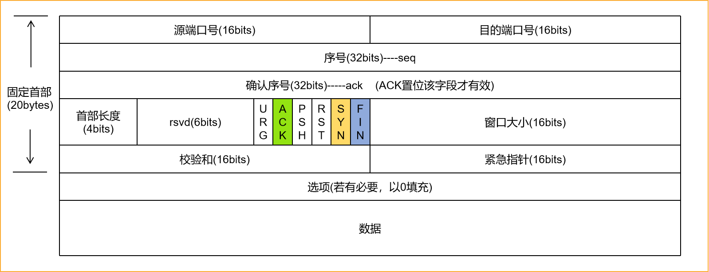

# 《图解HTTP》阅读纪要


## <a name="catalog">目录</a>

#### 1. [网络模型与TCP协议](#firstSeg)


## 1. <a name="firstSeg">网络模型与TCP协议</a>
#### 1.1 URL 和 URI
客户端是指通过发送请求获取服务器资源的 Web 浏览器等程序。 Web 使用 HTTP (HyperText Transfer Protocol，超文本传输协议)作为规范，完成客户端和浏览器之间的通信。

我们在使用 Web 浏览器访问 Web 等页面时输入的网页地址，就是 URL。 URL叫做统一资源定位符(Uniform Resource Locator)。另外，还有一种URI(Uniform Resource Identifier，统一资源标识符), 是指由某种协议方案表示的资源的标识符，此处协议方案是指 HTTP、 ftp、 mailto、telnet、 file 等协议类型的名称。可见，URI 是用字符串标识某一互联网资源，而 URL 表示资源在互联网上所处的位置，可见 URL 是 URI 的子集。

```
  // URI 示例
  ftp://ftp.is.co.za/rfc/rfc1808.txt <br>
  mailto://John.Doe@example.com
  http://www.itef.org/rfc/rfc2396.txt
```

#### 1.2 OSI七层模型及TCP/IP四层模型

1. OSI 七层模型由上到下分别为：
	* 应用层
	* 表示层
	* 会话层
	* 传输层
	* 网络层
	* 数据链路层
	* 物理层

2. TCP/IP 协议则进行了简化，包含如下四层：
	* **应用层** ： 把需要通过网络传输的`数据`按照特定的标准协议的格式进行编码。一个进程对应一个端口号。应用层使用如下基于传输层协议TCP或UDP的协议之一：
		* 基于TCP的协议：
			1. `HTTP` (默认80端口)：主要用于普通浏览
			2. `HTTPS` (443端口)： HTTP协议的安全版本
			3. `FTP` (20和21端口)：用于文件传输
			4. `POP3` (110端口)： 用于接收邮件
			5. `SMTP` (25端口)： 用于发送邮件
			6. `TELNET` (23端口)： 用于通过一个终端登录到网络
			7. `SSH` (22端口)： 用于替代安全性差的TELNET, 可以加密安全登录
		* 基于UDP的协议：
			1. `DHCP` (67端口，动态主机配置协议): 用于动态配置IP地址
	* **传输层**：建立应用程序用于特定任务数据交换的基本数据通道，提供端到端的消息传输服务。

	* **网络层**：负责通过潜在的多个网络发送数据包，从源网络发送数据到目的网络的过程，叫做路由。网络层协议提供两个基本的功能：
		* 主机寻址和识别：由 `分层IP寻址系统` 完成 
		* 数据包路由： 将数据包转发到靠近目的地的下一个网络路由器。

	* **数据链路层**：用于在同一链路不同主机的网络层接口之间移动数据包。


#### 1.3 应用层协议HTTP


#### 1.4 传输层TCP协议
TCP (Transmission Control Protocol，传输控制协议)是一种面向连接的、可靠的、基于字节流的传输层通信协议。

##### 1.4.1 TCP的三次握手和四次挥手

* 三次握手
	* 客户端发送SYN报文(seq=x)请求建立连接，进入SYN_SEND状态
	* 服务器收到SYN报文，回ACK报文(ack=x+1)表示确认，同时发送SYN报文(seq=y)，进入SYN_RECV状态
	* 客户端收到服务器的SYN，回ACK报文(ack=y+1，seq=x+1)表示确认 ，进入Established状态 ，服务器在收到ACK报文后 ，也进入Established状态。

* 四次挥手
	* 客户端发送一个 FIN ， 告诉服务器想关闭连接
	* 服务器收到这个 FIN， 发回一个 ACK
	* 服务器通知应用程序关闭网络连接，应用程序关闭后通知服务器，服务器发送一个FIN 给客户端，通知连接已关闭。
	* 客户端发回 ACK报文确认。

之所以断开连接需要四步，是因为建立连接时，服务器可以把ACK和SYN一起回复，但是在断开连接时，服务器立马回了ACK，但是需要等待应用程序关闭网络连接后才可以发送FIN，这样ACK和FIN分开发送，就多了一个步骤。

##### 1.4.2 TCP报文格式

tcp 报文格式如下：



* **序号 seq**
  1. SYN 置1，则为初始的序号
  2. SYN 清0，则为当前会话的累加序号

* **确认序号 ack**

　　如果ACK置1，则该值为 ACK报文发送者所期望的下一个 `序号`，表示确认收到之前的字节，每端发送的第一个ACK确认另一端的初始序号。

* **首部长度**

　　单位是4字节，最小为5，最大为15。即首部最少20字节，最多60字节。

* **ACK**

　　置位表明确认序号字段有效。客户端在初始的SYN包之后的所有包都必须将这个标志位置位。

* **SYN**

　　置位表明是发送端的第一个包。在建立连接时使用，用于同步序号。当 SYN=1，ACK=0时，表示是请求建立连接的报文，当SYN=1,ACK=1时，表明对方同意建立连接，只有前两次握手中SYN才置1.

* **FIN**

　　置位表明是发送端的最后一个包。


<br>[Top](#catalog)

## 2. <a name="SecondSeg">简单的HTTP协议</a>
## 3. <a name="ThirdSeg">HTTP报文内部的HTTP信息</a>


<br><br><br><br><br><br><br><br><br><br><br><br>


