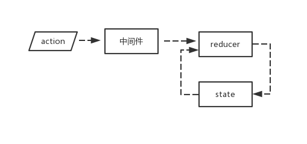

# React基础知识概括

## 目录
1. [React组件](#1-React组件)
2. [组件通信](#2-组件通信)
3. [Redux](#3-Redux)
4. [React Context API](#4-React-Context-API)
5. [React Hooks API](#5-React-Hooks-API)
6. [React Router](#6-React-Router)
7. [React生命周期](#7-React生命周期)
8. [React的css in JS方案](#8-React的CSS-in-JS方案)
9. [React环境搭建](#9-React环境搭建)
10. [React-Redux的使用](#10-React-Redux的使用)
11. [Redux的中间件和异步操作](#11-Redux的中间件和异步操作)
<br><br>

## 1. React组件 
* JSX语法：扩展的JS语法，可使用JSX语法在JS中编写类似HTML结构的代码
* React的组件名称首字母必须大写
* React中类的方法默认不绑定`this`，可使用`bind`或`箭头函数`手动绑定
* React的组件必须返回一个JSX元素，返回并列多个JSX元素不合法，需要用一个外层的JSX元素将所有内容包裹起来
* React中可通过`this.state`存储局部变量，当`this.state`发生变化时，会引发组件的重新渲染，React仅可通过`this.setState()`方法来修改state的值
* React的组件可通过函数或者class来定义，当组件有自身的内部状态时，使用class，此时使用`constructor`时，一定要调用`super()`
* React的组件有`this.props.children`属性，表示组件的所有子节点
* 组件类的`propTypes`属性，可用于定义组件实例的属性类型，验证传入参数类型是否符合要求
* 对于动态数量的子组件，每个子组件都必须带上值唯一可标示子组件的key属性，key的作用是为了在diff算法执行时更快的找到对应的节点，提高diff速度。
* 接收 key 的组件无法读取 key 的值，因为key 和 ref 都是 React 保留的两个特殊的 prop ,并未预期让组件直接访问。

<br>[top](#目录)<hr>

## 2. 组件通信 

### 2.1 父子通信
* 父组件传递数据给子组件时，在调用子组件的地方将数据作为属性的值传入，子组件即可通过`props.属性`获取到数据
```javascript
 <Parent>
   <Child name='jack'/>  //在组件Child中可通过this.props.name获取值‘jack’
 </Parent>
```
* 子组件传递数据给父组件时，需要父组件事先定义一个函数，并通过props传给子组件，子组件在特定时机调用此函数，函数的传入参数即可作为传入的数据

### 2.2 任意组件通信 
#### 2.2.1 使用EventHub
  * 即为发布订阅模式，使用trigger触发一个事件并传递数据，使用on监听事件并获取数据
  * 一个组件监听某个事件，另一组件触发相同事件并传参，即可实现两个组件的通信
  * 缺点：事件容易越来越多，不易控制代码复杂度，且对事件不好统一管理

  ```js
  let money = {
    mount: 100000
  }
  let fnLists = {}
  let eventHub = {
    trigger(eventName,data){
      let  fnList= fnLists[eventName]
      if(!fnList){return}
      for(let i=0;i<fnList.length;i++){
        fnList[i](data)
      }
    },
    on(eventName,fn){
      if(!fnLists[eventName]){
        fnLists[eventName]=[]
      }
      fnLists[eventName].push(fn)
    }
  }

  //eventHub.on('我要花钱',(data)=>{money.mount-=data;})
  //eventHub.trigger('我要花钱',100)
  ```

#### 2.2.2 使用Redux  
  * 根据定义的reducer方法创建store,reducer方法为纯函数，根据原先的state以及接收到的action返回新的state
  * 子组件的操作派发(调用`store.dispatch()`)一个action对象(包含type以及其他数据)
  * reducer利用接收的action以及旧的state按照预先定义的规则更新store中的state
  * 使用store.subscribe()监听state变化，一旦state变化就重新render

  ```js
    const reducer = (state=0,action)=>{
      switch(action.type){
        case 'add':
          return (state + action.data);
        default:
          return state;
      }
    }

    const store = createStore(reducer)

    //store.dispatch({type:'add',data:1})
    //store.subscribe(()=>{render()})
  ```
<br>[top](#目录)<hr>

## 3. Redux 

　实际应用中，并不一定需要使用Redux，当UI层十分简单，互动较少时，使用Redux则会增加应用的复杂性。<br>
　当应用有如下场景时，可考虑使用Redux:

      · 某个组件的状态，需要共享
      · 某个状态需要在任何地方都可获取
      · 一个组件需要改变全局状态
      · 一个组件需要改变另一个组件的状态

### 3.1 基本概念
#### 3.1.1 **Store**
* `Store`是保存数据的的地方，整个应用只能有一个Store,可使用`createStore`函数来生成Store。

#### 3.1.2 **State**
* `Store`对象包含所有的数据，若想得到某个时点的数据，就要对Store生成快照，这种时点的数据集合，叫做**State**。
* 当前时刻的 State ，可以通过`store.getState()`得到。
* Redux 规定，一个 State 对应一个 View ，只要 State 相同，View 就相同。

#### 3.1.3 **Action**
* Action 是 View 发出的通知，表示 State 应该要发生变化了。
* Action 是一个对象。其中的type属性是必须的，表示 Action 的名称。其他属性可以自由设置。
* 可以这样理解，Action 描述当前发生的事情。改变 State 的唯一办法，就是使用 Action。它会运送数据到 Store。

#### 3.1.4 **store.dispatch()**<br>
* `store.dispatch()`是发出Action的唯一方法，它接受一个 Action 对象作为参数，将它发送出去。

#### 3.1.5 **Reducer**
* Store 收到 Action 后，必须给出一个新的State，才会使View发生变化，State的这个计算过程就叫 Reducer。
* Reducer 是一个纯函数，接受 Action 和当前 State 作为参数，返回一个新的 State。纯函数就意味着，只要是同样的输入，必定得到同样的输出。所以，Reducer 函数里面不可改变State，必须返回一个全新的对象。 
* `store.dispatch()`会触发 Reducer 的自动执行，`createStore()`接受 Reducer 作为参数，生成一个新的 Store，每当`store.dispatch()`发送过来一个新的 Action，就会自动调用 Reducer，得到新的 State。

#### 3.1.6 **store.subscribe()**
* Store 允许使用`store.subscribe()` 方法设置监听函数，一旦State发生变化，就会自动执行这个函数。
* `store.subscribe()`方法会返回一个函数，调用这个函数就可以解除监听。

#### 3.2 Reducer的拆分
* 由于整个应用只有一个 State 对象，对于大型应用而言，这个 State 必然十分庞大，导致负责生成 State 的Reducer函数也十分庞大。我们可以把Reducer 函数进行拆分，不同函数负责处理不同属性，最终合并为一个大的Reducer即可
* Reducer提供了一个`combineReducer`方法，用于合并多个子组件所对应的 Reducer。
```js
  import {createStore, combineReducers} from 'redux';
  import {reducer as todoReducer} from './todos';
  import {reducer as filterReducer} from './filter';

  //todos 以及 filter 分别为 state 的属性名
  const reducer = combineReducers({
    todos: todoReducer,
    filter: filterReducer
  });

  export default createStore(reducer);
```

<br>[top](#目录)<hr>

## 4. React Context API 
孙子组件要使用爷爷组件的数据时，原先只能通过props一层一层传递，`Context` 提供了一种传递数据的方法，避免通过中间元素传递props。

* context 即为局部的全局变量
  * 调用`{Provider, Consumer} = React.createContext(defaultValue)` 创建一个context，可初始化默认值。
  * 使用`<Provider value={obj}> </Provider>` 包裹住顶层组件，即可把value属性传递给 Provider 的后代 Consumers 。
  * 在JSX语句中使用`<Consumer>{data => <Child x={data.n}/>} </Consumer>` 即可使用数据，此处`data`等于组件树中上层 context 的最近的 Provider 的`value`属性，若没有Provider，则为创建context时的defaultValue。

<br>[top](#目录)<hr>

## 5. React Hooks API 
#### 5.1. 引言
React Hooks 是 React 16.7.0-alpha 版本推出的新特性 ，其推出主要是为了解决状态共享的问题。 函数组件是没有状态的，组件若想有状态则需要使用 class，但是 Hooks 的出现则解决了函数组件没有状态的问题。

* Hooks只能在函数组件内部被调用
* 约定Hooks 函数必须以 "use" 命名开头，因为这样才方便 eslint 做检查 

#### 5.2. Hooks API --- useState

调用`useState` API 会返回一个数组，包含一个值以及一个用于更新这个值的函数。
```js
  import { useState } from 'react';

  function App(){
    const [value, setValue] = useState(0);  // 设置value的初值为0

    const add = ()=>{
      setValue(value+1)
    }

    return (
      <div>
        <div>{value}</div>
        <button onClick={add}>+1</button>
      </div>
    )
  }
```
#### 5.3. Hooks API --- useEffect
可以在 useState 附近，使用 useEffect 在函数组件中执行一些具有副作用的操作。
* 副作用： 依赖了一些未知来源的数据或表达式的代码
* 将有副作用的函数写到 useEffect 中，但是试验了下在函数组件内部直接执行函数，不写到useEffect中，也可以得到期望的结果。
```js
  import {useEffect} from 'react';

  function App(){
    //...

    useEffect(()=>{
      document.querySelector('#test').innerText = value;
    })

    //...
  }

```


<br>[top](#目录)<hr>

## 6. React Router 
#### 6.1 基本概念
##### 6.1.1 location 和 路由

　location 接口表示其链接到的对象的位置(URL)。Document 和 Window 接口都有 location 属性。 location 的属性包含 hash 属性和 pathname 属性，我们根据 hash 值或者 pathname 的值寻找对应应用内容的过程，就叫做路由。需要注意的是，当直接改动 location.hash 时，不会引起页面刷新，当直接改动 location.pathname 时，会引起页面的刷新，不过 window 的 history.pushState() 方法可以实现修改 pathname 而不刷新页面。可是对应不同的 pathname 使用 pushState() 方法时需要进行很多的条件判断，React-Router 库提供的 Router 组件则可以帮助我们十分简便的解决这个问题。

##### 6.1.2 React Router v4

　`React Router v4` 是一个流行的纯React重写的包，在此版本中 React Router被拆分成三个包：react-router, react-router-dom 和 react-router-native 。 react-router 提供核心的路由组件与函数。其余两个则提供运行环境（即浏览器与react-native）所需的特定组件。 
  * `react-router`： 实现了路由的核心功能
  * `react-router-dom` : 基于 react-router , 加入了在浏览器运行环境下的一些功能，例如 `Link` 组件，可用于渲染一个 a 标签；还比如 `BrowserRouter` 和 `HashRouter` 组件，前者使用 pushState 和 popState 事件构建路由，后者使用 window.location.hash 和 hashchange 事件构建路由。
  * `react-router-native`: 基于 react-router ，类似 react-router-dom ，加入了 react-native 运行环境下的一些功能。
<br>
当在浏览器环境下使用 react-router 时，则需要安装react-router-dom：

```
   npm install --save react-router-dom
```
#### 6.2 React Router 的组件
##### 6.2.1 Router  
* Router组件是一个通用的低级接口，一般会使用下面其中一个高级路由组件：
```
  <BrowserRouter>、 <HashRouter>、 <MemoryRouter>、 <NativeRouter>、< StaticRouter>
```
* Router 组件本身只是一个容器，真正的路由要通过 Route 组件来定义

##### 6.2.2 Route
* 其主要职责是一旦当前路径匹配 Route 的 path 属性时，就会按照以下方式之一进行渲染：
  * component , 渲染 component 属性指定的组件: `<Route path="/user/:username" component={User}/>`
  * render , 执行对应的函数，很方便的进行内联渲染:  `<Route path="/home" render={() => <div>Home</div>}/>`
  * children, 与 render 类似，不同的是，当路径匹配或否时，都会渲染。

##### 6.2.3 Link
* Link 组件用于实现 <a> 标签的功能，会生成一个链接，允许用户点击后进行路由的切换。

##### 6.2.4 使用react-router-dom

```js
   // use react-router-dom
   import { BrowserRouter as Router, Route, Link } from "react-router-dom";
   ReactDOM.render(
   <Router>
      <div>
        <div>
          <Link to="/login"><button>登录</button></Link>       // "/"代表从根路径开始匹配
          <Link to="/signup"><button>注册</button></Link>
        </div>
        <Route path="/login" component={Box1} />            
        <Route path="/signup" component={Box2} />
      </div>
    </Router>,rootElement);

```

<br>[top](#目录)<hr>

## 7. React生命周期 

React 组件的生命周期分为三个阶段，分别为： 装载过程，更新过程，卸载过程。

#### 7.1 装载阶段(mount)
即为组件的初始化阶段，就是把组件第一次在DOM树中渲染的过程，仅会发生一次，依次调用的函数如下：
* constructor
* getInitState 
* getDefaultProps  // 注意，getInitState 和 getDefaultProps 仅在使用 React.createClass方法创造组件类时才会发生作用。
* componentWillMount
* render  //仅返回一个jsx描述的结构，最终由 React 来操作渲染过程。
* componentDidMount

#### 7.2 更新阶段(update)
当 props 或者 state 被修改时，就会引发组件的更新过程，会依次调用下面的生命周期函数：
* componentWillReceiveProps
* shouldComponentUpdate
* componentWillUpdate
* render
* componentDidUpdate

#### 7.3 卸载阶段(unmount)
当 React 组件要从 DOM 树上删除掉之前，对应的`componentWillUnmount` 函数会被调用，该函数适合做一些清理性的工作，例如在`componentDidMount` 中用非 React 的方式创造了一些 DOM 元素，若撒手不管则可能会引起内存泄漏，则需要在 componentWillUnmount 中把创造的 DOM 元素清理掉。


<br>[top](#目录)<hr>

## 8. React的CSS-in-JS方案 
React 对 HTML 的封装是 JSX语言，对 CSS 的封装沿用了 DOM 的 style属性对象，由于CSS的封装非常弱，导致了一系列的第三方库用于加强 React 的 CSS 操作，在此主要介绍`styled-components` 以及 `css-modules`两种方案。

#### 8.1 styled-components

styled-components 使用标签模板来对组件进行样式化，它移除了组件和样式之前的映射，这就意味着，在定义样式时，实际上创造了一个正常的 React 组件，而且样式也会附在上面。

##### 安装
```
    npm install --save styled-components
```
##### 使用
```js
    import styled from 'styled-components';

    const Title = styled.div`
      font-size: 14px;
      text-align: center;
      color: red;
    `;

    <Title> Hello World! </Title>
```


#### 8.2 css-modules 

<br>[top](#目录)<hr>

## 9. React环境搭建 

* 使用官方脚手架工具 create-react-app 创建 React 应用；
* 修改 .gitignore 文件，可以自由定制上传到 git 的文件/目录；
* 运行 yarn/npm build ，用于生成展示给用户的html；
* 根据提示，设置 package.json 中的 homepage, 为` https:// xxxxxx\build\`, 设置完毕需要重新build


<br>[top](#目录)<hr>

## 10. React-Redux的使用 

使用 react-redux 需要安装 redux 以及 react-redux:
```js 
  npm install --save redux
  npm install --save react-redux
```

### 10.1 展示组件和容器组件
* React-Redux将所有组件分为两大类:
  * 处于内层只负责渲染界面的组件，叫做UI组件(presentational component);
  * 处于外层负责和Redux Store打交道的组件，叫做容器组件(container component);
* React-Redux规定，所有的展示组件都由用户提供，容器组件则是React-Redux自动生成。

### 10.2 connect方法 
React-Redux提供`connect`方法，用于从UI组件生成容器组件。connect接受两个参数 mapStateToProps 以及 mapDispatchToProps，其执行结果仍是一个函数，此时将UI组件Counter作为参数传入，得到的结果即为容器组件 CounterContainer。

```js
  import { connect } from 'react-redux'
  const CounterContainer = connect(mapStateToProps,mapDispatchToProps)(Counter);
```
作为容器组件，要做以下两件事情：
* 将外部的数据(即 state 对象)转化为内层UI组件的props
* 把UI组件中，用户的动作转化为Action对象，派送给Store

这两个工作一个是内层UI组件的输入，一个是内层UI组件的输出，即分别对应参数 mapStateToProps 和 mapDispatchToProps 这两个函数所做的事情。

#### 10.2.1 **mapStateToProps**
* mapStateToProps 是一个函数，返回的是一个对象，包含组件所需使用的state中的部分数据，组件可直接通过`this.props.属性`引用数据。
* mapStateToProps 的第一个参数始终是state，还可以使用第二个参数`ownProps`，代表直接传递给容器组件的 props 对象，需要注意的是，若使用了`ownProps`作为参数，如果容器组件的参数发送变化，也会引起 UI 组件的重新渲染。
* connect 方法可以省略 mapStateToProps 参数，这样UI组件就不会订阅 Store，当Store发生更新时不会引起UI组件的更新。
```js
  const mapStateToProps = (state)=>{
    return {
      todos : selectTodos(state.todos,state.filter)
    }
  }
```

#### 10.2.2 **mapDispatchToProps**
* mapDispatchToProps 用于把 UI 组件暴露出来的函数类型的prop关联上 `dispatch`函数的调用,它可以是一个函数，也可以是一个对象。
* mapDispatchToProps 是函数时，包含两个参数，分别为 dispatch(必须) 以及 ownProps。
```js
  function mapDispatchToProps(dispatch){
    return {
      add1: ()=>{
        dispatch({type:'add',payload:1}) 
      },
      add2: ()=>{
        dispatch({type:'add',payload:2}) 
      }
    }
  }
```

* mapDispatchToProps 是对象时，它的每个键名是对应 UI组件的同名参数，键值是一个函数,返回的Action会由Redux自动发出。
```js
  const mapDispatchToProps= {
       add1: ()=>{
         return {type:'add',payload:1}
       }
  }
```


#### 10.3 Provider
* React-Redux 提供 Provider 组件，可以让容器组件拿到 state 。
```js
  ReactDOM.render(
    <Provider store={store}>
      <TodoApp />
    </Provider>, 
    document.getElementById('root'));
```

　上述代码中，使用 Provider 在根组件 TodoApp 外面包了一层，这样 TodoApp 的所有子组件默认都可以拿到 state 了。

* Provider 的原理是 React 组件的 [context](#4-React-Context-API) 属性。
* React-Redux 定义了 Provider 的 `componentWillReceiveProps` 函数，在React组件的生命周期中，componentWillReceiveProps 函数在每次重新渲染时都会调用到。

<br>[top](#目录)<hr>

## 11. Redux的中间件和异步操作
### 11.1 React组件访问服务器
在 React 应用中访问服务器的一种趋势是使用浏览器原生支持的`fetch`函数来访问网络资源，fetch 函数返回的结果是一个 Promise 对象，对于不支持 fetch 的浏览器版本，也可以通过 fetch 的 polyfill 增加对fetch的支持。<br>
  * 在本地访问API时，会遇到跨域的情况，解决跨域访问API的一个方式就是通过代理(proxy)，由于跨域访问API的限制是针对浏览器的行为，服务端无任何限制。可以使自己的网页访问所属域名下一个服务器的API接口，再让该服务器去把请求转发给实际所需请求的域名下的API，接收到数据后再让该服务器把数据转发回来。
  * 通常我们在组件的`componentDidMount`函数中发送请求获取服务器的资源，这是因为React16之后采用了Fiber架构，只有componentDidMount声明周期函数是确定被执行一次的，类似ComponentWillMount的生命周期钩子都有可能执行多次。
  * 需要注意的是，fetch 认为只要服务器返回合法的 HTTP 响应就算成功，就会调用`then`提供的回调函数，即使状态码是表示出错了的 400 或 500，所以需要在 then 中首先检查传入参数 response 的status字段，当为 200 或 304 时才继续，否则以错误处理。

当组件变得庞大复杂时，应该尽量把应用的状态存放在 Redux Store 中，同样，访问服务器的操作应该由 Redux 来完成。

### 11.2 Redux访问服务器 
 Redux 的单向数据流是同步操作，用户操作派发一个 action 对象后，reducer 会根据旧的 state 以及接收到的 action 生成新的 state，然后会即刻引发组件的渲染更新，这其中并没有执行异步操作的机会，Redux 提供了 thunk 的解决方案，可以使得 Reducer 在异步操作结束后自动执行。

#### 11.2.1 **redux-thunk 中间件**
* redux-thunk 提供一个 Redux 中间件，我们需要在创建 Store 时用上这个中间件。在 action 对象派发后，调用 reducer 函数之前，会先经历一个中间件环节，此时即为产生异步操作的机会。


```
  npm install --save redux-thunk  //redux-thunk是一个独立的发布包，需要单独安装
```

#### 11.2.2 **使用中间件**
```js
  // Store.js
  import { applyMiddleware, createStore } from 'redux';
  import thunkMiddleware from "redux-thunk";

  //如果还需要使用什么中间件，直接push到middlewares中即可
  const middlewares = [thunkMiddleware];

  export default createStore(reducer, {},  applyMiddleware(...middlewares));
```

*  `applyMiddleware` 是 Redux 的原生方法，作用是将所有中间件组成一个数组，依次执行。


#### 11.2.3 **异步 action 对象**
* 异步 action 对象不是一个普通的JS对象，而是一个函数。
* redux-thunk的工作是检查 action 对象是否为函数，如不是则直接放行，完成普通 action 对象的生命周期 ，若是 ，则会执行该函数 ，并把 Store 的dispatch 函数和 getStatus 函数作为参数传递到函数中去。 不会让这个异步action对象继续往前派发到reducer函数。
```js
  const increment = ()=>({
    type: 'add',
    payload: 1
  }); 

  // 异步action构造函数
  const incrementAsync = ()=>{
    return (dispatch) => {
      setTimeout(()=>{
        dispatch(increment());
      },1000);
    }
  }
  
  //通过dispatch派发异步 actionCreator
  const mapDispatchToProps = (dispatch) => {
    return {
      onClick: () => {
        dispatch(incrementAsync());
      }
    }
  }; 

```
上述示例中，异步action构造函数返回一个新的函数，当这个函数被dispatch派发后，会被redux-thunk执行，于是setTimeout发挥作用，在1s之后利用参数dispatch派发出同步action构造函数increment的结果。

#### 11.2.4 **异步操作模式**

* 同步操作只要发出一种 Action 即可，异步操作需要发出三种 Action，且针对这三种 action类型，需要定义三种对应的状态类型。分别为：
  * 表示异步操作已经开始的 action 类型，表示异步操作正在进行中(status.LOADING)；
  * 表示异步操作成功的action类型，表示异步操作已经成功完成(status.SUCCESS)；
  * 表示异步操作失败的action类型，表示异步操作已经失败(status.FAILURE)。
* action 的类型只能用于 action 对象中，状态的类型则是用来表示视图。
* 异步action构造函数的套路代码如下：
```js

  export const sampleAsyncAction = ()=>{
    return (dispatch,getState) => {
      dispatch(fetchStarted());  //用于将view置于“有异步action未完成”的状态，提示作用
      fetch(apiUrl).then((res)=>{
        if(res.status !== 200){
          throw new Error('res status: '+ res.status);
        }
        res.json().then(json => {
          dispatch(fetchSuccess(json.data));
        }).catch(error =>{
          throw new Error('invaild json'+ error);
        })
      }).catch(error => {
        dispatch(fetchFailure(error))
      })
    }
  }

  //store.dispatch(sampleAsyncAction())

```

#### 11.2.5 **异步操作的中止**

<br><br><br>


### 11.2 Redux异步操作的其他方法
* redux-saga
* redux-promise


<br>[top](#目录)<hr>


<br><br><br><br><br><br><br><br><br><br><br><br><br><br><br><br><br><br><br><br><br><br><br><br><br><br><br><br><br><br><br><br><br><br><br><br><br><br><br><br><br><br><br><br><br><br><br><br><br><br><br><br><br><br><br><br><br><br><br><br><br><br><br><br><br><br><br><br><br>


