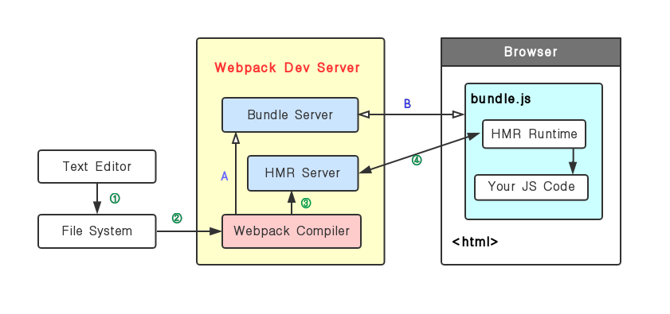

# Webpack学习

### 1. 安装webpack

由于webpack4开始，将webpack内核以及webpack-cli分开了，所以使用时需要同时安装webpack以及webpack-cli

```js
yarn add webpack webpack-cli -D

./node_modules/.bin/webpack -v  //可以查看项目中安装的webpack的版本
```

##### 1.1 简要使用webpack

创建一个`webpack.config.js`文件，

```js
'use strict';
const path = require('path')
module.exports = {
  entry: './src/index.js',
  output: {
    path: path.join(__dirname, 'dist'),
    filename: 'bundle.js'
  },
  mode: 'production'
}

// 在./src/index.js 编写 js， 运行webpack ， 即可以在./dist中找到打包后的bundle.js文件
```

局部安装的模块，会在`node_modules/.bin`目录创建软链接，`package.json`可以默认读取到.bin目录下的命令，则可以通过在`package.json`的`scripts`属性中添加一条 :

```js
scripts: {
  "build" : webpack
}

//此时运行webpack可使用如下指令
npm run build  //则会自动去node_modules中去寻找webpack 
```


<hr/>

### 2. Webpack 基础用法一： 基础概念

##### 2.1 Entry 

webpack中会将代码以及非代码如图片、字体依赖等加到依赖图中，依赖图的入口是**Entry**。对应于源代码。

webpack会根据入口文件去寻找依赖，将依赖都加入依赖树，根据依赖树打包生成最后的文件。

###### 2.1.1 单入口： entry是一个字符串， 适用于单页应用

```
module.exports = {
  entry: './src/index.js'
}
```

###### 2.1.2 多入口： entry是一个对象，适用于多页应用

```js
module.exports = {
  entry: {
    app: './src/app.js',
    adminApp: './src/adminApp.js'
  }
}
```


##### 2.2 Output

Output 用来告诉webpack如何将编译后的文件输出到磁盘。对应于结果代码。

###### 2.2.1 单入口

```js
module.exports = {
  entry: './path/to/my/entry/file.js',
  output: {
    filename: 'bundle.js',
    path: __dirname+'/dist'
  }
}
```

###### 2.2.2 多入口

```js
module.exports = {
  entry: {
    index: './src/index.js',
    search: './src/search.js'
  },
  output: {
    // 通过占位符确保文件名称的唯一， name为打包后文件的名称
    filename: '[name].js',       
    path: __dirname + '/dist'
  }
}
```

build之后，就可以在 `/dist` 目录发现`index.js`以及`search.js`


##### 2.3 Loaders

Webpack 开箱即用只支持 JS 和 JSON 两种文件类型，通过Loaders 去支持其它文件类型并且把它们转化为有效的模块，并且可以添加到依赖图中。

Loaders 本身是一个函数，接受源文件作为参数，返回转换的结果。

###### 2.3.1 常见的Loaders

| 名称          | 描述                             |
| -| - |
| babel-loader  | 转换ES6、ES7等JS新特性语法       |
| css-loader    | 支持.css文件的加载和解析         |
| less-loader   | 将less文件转换成css              |
| ts-loader     | 将 TS 转换为 JS                  |
| file-loader   | 进行图片、字体等富媒体文件的打包 |
| raw-loader    | 将文件以字符串形式导入           |
| thread-loader | 多进程打包 JS 和 CSS             |

###### 2.3.2 Loaders的用法

```js
module.exports = {
  output: {
    filename: 'bundle.js'
  },
  module: {
    rules: [
      {
        test: /\.txt$/,      // test 指定匹配规则
        use: 'raw-loader'   // use 指定使用的 loader名称
      }
    ]
  }
}
```


##### 2.4 Plugins

Plugins（插件）用于打包输出的bundle.js文件的优化，资源管理和环境变量注入，

Plugins 作用于整个构建过程。

###### 2.4.1 常见的 Plugins 有哪些？

| 名称                     | 描述                                                         |
| ------------------------ | ------------------------------------------------------------ |
| CommonsChunkPlugin       | 将chunks相同的模块代码提取成公共js<br />(将不同页面引用的相同的js模块提取为公共的) |
| CleanWebpackPlugin       | 清理构建目录                                                 |
| ExtractTextWebpackPlugin | 将CSS文件从bundle.js文件中提取成一个独立的css文件            |
| CopyWebpackPlugin        | 将文件或者文件夹拷贝到构建的输出目录                         |
| HtmlWebpackPlugin        | 创建html文件去承载输出的bundle，常用于多页面打包，可自动生成`*.html`文件，而不需要手动去 dist/ 目录中新建一个 `*.html`文件 |
| UglifyjsWebpackPlugin    | 压缩JS                                                       |
| ZipWebpackPlugin         | 将打包出的资源生成一个zip包                                  |

###### 2.4.2 使用 plugins

```js
module.exports = {
  output: {
    filename: 'bundle.js'
  },
  plugins: [
    new HtmlWebpackPlugin({     // 放到plugins数组中
      template: './src/index.html'
    })
  ]
}
```


##### 2.5 mode

Mode 用于指定当前的构建环境是： production、development 还是none

设置 mode 可以使用webpack 内置的函数，默认值为 production

mode 是 webpack4 才提出的概念。


##### 2.5.1 mode的内置函数功能

| 选项        | 描述 |
| - | - |
| development | 设置 `process.env.NODE_ENV`的值为 `development`.<br />开启`NamedChunksPlugin` 和`NamedModulePlugin`，可以在代码热更新阶段在控制台打印是哪个模块发生了热更新，以及打印模块的路径。 |
| production  | 设置 `process.env.NODE_ENV`的值为 `production`.<br />开启`FlagDependencyUsagePlugin` ,`FlagIncludedChunksPlugin`,等。。。<br />此时webpack 会默认去压缩，检测变量是否有副作用等等。 |
| none        | 不开启任何优化选项  |


<hr/>

### 3. Webpack基础用法二： 资源解析

##### 3.1 解析 ES6和React JSX

使用 **babel-loader**, 增加webpack配置如下：

```js
module.exports = {
   entry: './src/index.js',
+  module: {
+    rules: [
+     {
+       // 指定使用 babel-loader 解析 .js 文件
+      	test: /\.js$/, 
+     	use: 'babel-loader'
+     }
+   ]
+ }
}
```

babel-loader依赖于babel， 其对应的配置文件是 : `.babelrc`，在配置文件中增加如下内容

```js
{
  "presets": [
+   "@babel/preset-env"    // 增加ES6的 babel prest配置
+   "@babel/preset-react"  // 增加 React 的 babel preset配置
  ],
  "plugins": [
    "@babel/proposal-class-properities"
  ]
}
```

对于 babel， 一个 "plugins" 对应一个功能，"presets" 是一系列 babel-plugins的集合。


>通常框架、组件和 utils 等业务逻辑相关的包依赖放在dependencies里面，对于构建、ESlint、单元测试等相关依赖放在devDependencies中


**使用操作步骤**：

```js
// 安装依赖
yarn add @babel/core @babel/preset-env babel-loader -D
yarn add react react-dom 
yarn add @babel/preset-react -D

// 根目录新建 .babelrc文件， 添加 "preset"的配置， 参见上述示例

// 修改 webpack.config.js， 在 module.rules 中添加 babel-loader的配置, 参见上述示例

```


##### 3.2 解析css、less 以及 scss

* less-loader 用于将 .less 转换为 .css

* css-loader 用于加载 .css 文件，并且转换为 commonJS对象

* style-loader 用于将样式通过 `<style>`标签插入到 head中

修改webpack配置文件如下：

```js
module.exports = {
  entry: './src/index.js',
  module: {
    rules: [
+     {
+       test: /\.css$/,
+       use: ['style-loader', 'css-loader']  // loader是链式调用，从右到左，注意顺序
+     },
+     {
+       test: /\.less$/,
+       use: ['style-loader', 'css-loader', 'less-loader'] 
+     },
+     {
+       test: /\.scss$/,
+       use: ['style-loader', 'css-loader', 'sass-loader'] 
+     }
    ]
  }
}
```


**使用操作步骤**

```js
// 安装依赖
yarn add style-loader css-loader -D
yarn add less less-loader -D   // less-loader依赖于 less，所以需要一起安装
yarn add node-sass sass-loader -D   // sass-loader 依赖于 node-sass

// 在webpack.config.js中添加上述配置
```


##### 3.3 解析图片和字体

* file-loader 用于处理文件(图片，字体等)

webpack配置如下：

```js
module.exports = {
  entry: './src/index.js',
  module: {
    rules: [
+     {
+       test: /\.(png|jpg|gif|jpeg)$/,
+       use: 'file-loader' 
+     },
+     {
+       test: /\.(woff|woff2|eot|ttf|otf)$/,
+       use: 'file-loader' 
+     }
    ]
  }
}
```


**使用操作步骤**

```js
// 安装依赖
yarn add file-loader -D

// 修改webpack配置

// 示例：在 css中使用字体
@font-face {
  font-family: 'SourceHanSerifSC-Heavy';
  src: url('./SourceHanSerifSC-Heavy.otf') format('truetype');
}

h1 {
  font-family: 'SourceHanSerifSC-Heavy';
}
```


* **url-loader**，也可以解析图片和字体，此loader 可以针对较小资源自动做 base64转换。

```js
module.exports = {
  entry: './src/index.js',
  module: {
    rules: [
+     {
+       test: /\.(png|jpg|gif|jpeg)$/,
+       use: [{
+        loader: 'url-loader',
+        options: {
+          limit: 10240    // 单位为字节， 即资源小于10k时，webpack打包时会自动 base64
+        }
+      }]
+    }
    ]
  }
}
```


<hr>

### 4. Webpack 基础用法三： 热更新

##### 4.1 webpack中的文件监听

文件监听是在发现源码发生变化时，自动重新构建出新的输出文件。但是需要需要手动刷新浏览器

Webpack 开启监听模式有两种方式：

* 启动 webpack 命令时，带上 `--watch` 参数 ,  
* 在配置 webpack.config.js 中设置`watch: true`

文件监听的原理分析：

轮询判断文件的最后编辑时间是否变化，

某个文件发生了变化，并不会立刻告诉监听者，而是先缓存起来(放在本地磁盘)，等 aggregateTimeout

```js
module.export = {
  // 默认 false, 不开启
  watch: true,
  // 只有开启监听模式时，watchOptions才有意义
  watchOptions: {
    // 不监听的文件或者文件夹，默认为空，支持正则
    ignored: /node_modules/,
    // 监听到变化发生后会等300ms再去执行，默认300ms
    aggregateTimeout: 300,
    // 通过轮询判断文件是否变化，默认1000ms(1s)问一次
    poll: 1000
  }
}
```


##### 4.2  webpack的热更新

使用  **`webpack-dev-server(wds)`**, 主要用于开发环境

* WDS 不刷新浏览器
* WDS不输出文件，而是放在内存中
* 还需要使用 HotModuleReplacementPlugin 插件(此插件是webpack内置的)

```js
// 安装依赖
npm i webpack-dev-server -D

// 修改webpack配置
module.exports = {
+  plugins: [
+    new webpack.HotModuleReplacementPlugin()
+  ],
+  devServer: {
+    contentBase: './dist',
+    hot: true   // 注意设置为true，则会自动引入HotModuleReplacementPlugin
+  }
}
```


##### 4.3  使用 webpack-dev-middleware

WDM将 webpack 输出的文件传输给服务器，适用于灵活的定制场景.


##### 4.4 热更新的原理分析

- Webpack Compile : 将 JS 编译成 bundle.js
- HMR Server: 将热更新的文件输出给 HMR Runtime
- Bundle server:  是一个服务器，提供文件在浏览器的访问
- HMR Runtime： 会被注入到浏览器，更新文件的变化
- bundle.js: 构建输出的文件



* 第一次build完成，流程参考 `1---> 2---> A---> B`
* 后续代码发生变化，流程参考 `1---> 2---> 3---> 4`

这里面的热更新有最核心的是 **HMR Server** 和 **HMR runtime**。

HMR Server 是服务端，用来将变化的 js 模块通过 websocket 的消息通知给浏览器端。

HMR Runtime是浏览器端，用于接受 HMR Server 传递的模块数据，浏览器端可以看到 .hot-update.json 的文件过来。

webpack 构建出来的 bundle.js 本身是不具备热更新的能力的，HotModuleReplacementPlugin 的作用就是将 HMR runtime 注入到 bundle.js，使得bundle.js可以和HMR server建立websocket的通信连接。


<hr/>

### 5. Webpack 基础用法四： 其他

##### 5.1 文件指纹

文件指纹指的是： 打包后输出文件名的后缀， 用于做版本管理。

###### 5.5.1 常见的文件指纹

- **Hash**:  和整个项目的构建有关，只要项目文件有更改，整个项目构建的hash值就会更改
- **Chunkhash**： 和webpack打包的chunk(模块) 有关，不同的entry会生成不同的chunkhash值
- **Contenthash**:  根据文件内容来定义 hash，文件内容不变，则contenthash不变，如css文件

###### 5.5.2 JS文件指纹的设置

* 设置output的filename，使用[chunkhash]

* 设置MiniCssExtractPlugin的filename，使用[contenthash]，正常用了style-loader会将css插入到html的header中，一般就会用MiniCssExtractPlugin将css提取为单独的文件

  ```js
  yarn add mini-css-extract-plugin -D
  ```

  此插件是把css提取为单独的文件，所以会和`style-loader`冲突，应该需要将`style-loader`替换为`MiniCssExtractPlugin.loader`

* 设置file-loader的name, 使用[hash]

```js
module.exports = {
  entry: {
    app: './src/app.js',
    search: './src/search.js'
  },
  output: {
+   filename: '[name]_[chunkhash:8].js',   // 8代表取hash的前8位
    path: __dirname+'/dist'
  },
  plugins: [
+   new MiniCssExtractPlugin({filename: '[name]_[contenthash:8].css'});
  ]
}
```


##### 5.2 代码压缩

###### 5.2.1 js文件的压缩

Webpack4 内置了 uglifyjs-webpack-plugin，所以默认打包出来的js文件是经过压缩了的。但是也可以手动安装该插件，设置其他压缩参数，例如并行压缩等。

###### 5.2.2 css文件的压缩

 webpack3可以使用设置`css-loader`的minify来进行css的压缩，但是css-loader-v1.0后去掉了这个参数，所以需要采用其他方式进行压缩：

* 使用 optimize-css-assets-webpack-plugin， 同时还需使用预处理器cssnano

```js
module.exports = {
  plugins:[
+   new OptimizeCSSAssetsPlugin({
+     assetNameRegExp: /\.css$/g,
+     cssProcessor: require('cssnano')
+   })
  ]
}
```

###### 5.2.3 html文件的压缩

* 使用 html-webpack-plugin，设置压缩参数
  * bundle:  打包最终生成的文件
  * chunk： 每个chunk是由多个module组成，可以通过代码分割为多个chunk
  * module:  webpack中的模块(js、css、图片等)

```js
module.exports = {
  plugins: [
+   new HtmlWebpackPlugin({										// 一个页面对应一个HtmlWebpackPlugin
+     template: path.join(__dirname, 'src/search.html'),    //模板所在位置，可使用ejs语法
+     filename: 'search.html',                              //打包出来的文件名称
+     chunks:['search'],                                    //生成的html需要的模块
+     inject: true,																					// css和js会被插入 html
+     minify:{
+       html5: true,
+       collapseWhitespace:true,
+       preserveLineBreaks: false,
+       minifyCSS: true,       // 用于压缩一开始就内联在html中的css和js，而不是打包生成的css和js
+       minifyJS: true,
+       removeComments: false
+     }
+   })
  ]
}
```


<hr/>

### 6. Webpack 进阶用法

##### 6.1 自动清理构建目录产物

* 通过 npm scripts 清理构建目录

  ```js
  rm -rf ./dist && webpack   // 增减前置操作
  rimraf ./dist && webpack   // 使用 rimraf 库
  ```

  

* 使用 clean-webpack-plugin ，默认会删除output指定的输出目录

  ```js
  module.exports = {
    plugins: [
  +   new CleanWebpackPlugin()
    ]
  }
  ```

  

##### 6.2 CSS功能增强

###### 6.2.1 css3的属性为什么需要前缀？

* 以IE为代表的使用 **Trident 内核**的浏览器，其css需要加上 **-ms**的前缀
* 以Firefox 为代表的使用 **Geko内核**，其css需要加上**-moz** 
* 以Chrome为代表使用 **Webkit内核**，其css需要加上 **-webkit**
* 以Opera为代表使用 **Presto内核**，其css需要加上 **-o**

###### 6.2.2 使用 PostCSS插件autoprefixer自动补全css3的前缀

```js
// 安装依赖 
yarn add postcss-loader autoprefixer -D

// 修改 webpack.config.js
module.exports = {
  entry: './src/index.js',
  module: {
    rules: [
      {
        test: /\.scss$/,
        use: [
          'style-loader', 
          'css-loader', 
          'sass-loader',
+         {
+           loader: 'postcss-loader',
+           options: {
+           plugins: () => [
+             require('autoprefixer')({
+               // 设置兼容的浏览器版本，最近两个版本，使用率>1%， 以及 ios7 以上
+               browsers: ['last 2 version', '>1%', 'ios 7']  
+             })
+           ]
+         }
+       }
      ] 
     }
    ]
  }
}
```

注意： **最新更新的autoprefixer版本，需要在package.json或者.browserslistrc中设置browserslist，或者可以把 browsers 改成 overrideBrowserslist ，可以消除warn**


<hr>


