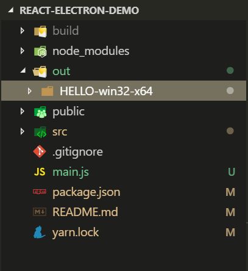

# 初学electron打包踩坑

今天初次接触electron，跟着网上的示例使用 react + electron + electron-package 对生成的文件进行打包，踩了一次坑，先记录下来。


### 创建应用及打包步骤


首先按照如下步骤新建一个react + electron的应用：

##### 1.创建应用目录
选定一个目录，使用react官方脚手架工具创建 react 应用，并安装依赖
```js
  create-react-app react-electron-demo 
  npm install
```

##### 2.新建 main.js 文件
在该目录下创建 main.js 文件，其中需要注意的是需要导入 path 和 url 模块，同时更改loadURL的内容
<details>
  <summary>main.js</summary>

```js
  const {app,BrowserWindow} = require('electron');
  const path = require('path')
  const url = require('url')

  // 保持window对象的全局引用，避免JS对象被垃圾回收时，窗口被自动关闭
  let mainWindow = null;

  function createWindow(){
    //创建窗口
    mainWindow = new BrowserWindow({width:800,height:600})

    //加载应用----适用于react开发时项目
    // mainWindow.loadURL('http://localhost:3000/')

    //加载应用 ----react 打包
    mainWindow.loadURL(url.format({
      pathname:path.join(__dirname,'./build/index.html'),
      protocol: 'file',
      slashes: true
    }))
    
    mainWindow.on('closed',function(){
      mainWindow = null
    })
  }

  // 当 Electron 完成初始化并准备创建浏览器窗口时调用此方法
  app.on('ready',createWindow)

  //所有窗口关闭时退出应用
  app.on('window-all-closed', function () {
    // macOS中除非用户按下 `Cmd + Q` 显式退出,否则应用与菜单栏始终处于活动状态.
    if (process.platform !== 'darwin') {
      app.quit()
    }
  })

  app.on('activate', function () {
    // macOS中点击Dock图标时没有已打开的其余应用窗口时,则通常在应用中重建一个窗口
    if (mainWindow === null) {
      createWindow()
    }
  })
```
</details>


##### 3.安装 electron 以及 electron-packager
```js
  //使用npm安装
  npm install electron --save-dev
  npm install electron-packager --save-dev

  //使用yarn安装
  yarn add electron --dev
  yarn add electron-packager --dev
```


##### 4.修改package.json
```js
  + "main": "main.js",
  + "homepage" : ".",
    "scripts": {
  +   "start-electron": "electron .",
  +   "package": "electron-packager . HELLO --platform=win32 --arch=x64 --out ./out --overwrite"
    }

```
##### 5.编译react应用
```js
  npm run build
```

##### 6.打包
```js
  npm run package
```
最后可在当前项目目录下的out文件夹中，找到HELLO-win32-x64文件夹，其中的HELLO.exe即为生成的应用。




### 注意的点

1.一个最基本的 electron 应用一般会有如下目录结构:
```c
myApp/
  |--- package.json
  |--- main.js
  |--- index.html
```
也即是说，使用 electron-packager 打包 electron 应用时，一定要注意，所指定的项目所在路径(`<sourceDir>`)中，一定要包含 **`package.json`** 以及 **`main.js`** 两个文件，如果打包好的 electron 应用点开后空白，则需要考虑是否是主进程所关联的页面寻址有问题。


