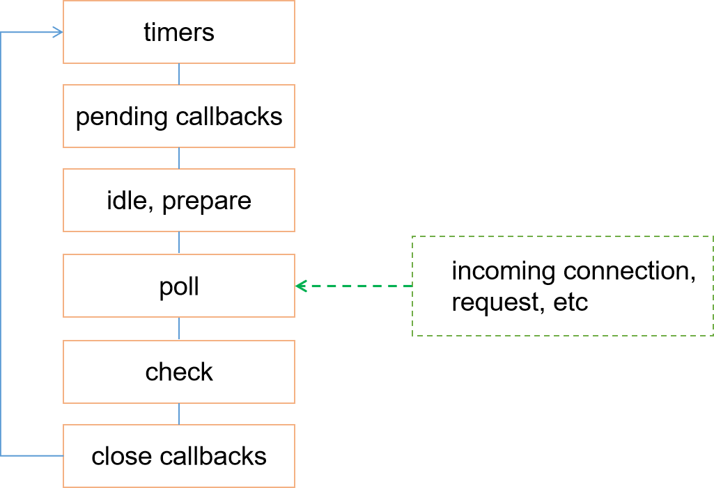

# 深入理解 EventLoop


## <a name="catalog">目录</a>

#### 1. [什么是Event Loop](#one)
#### 2. [浏览器的Event Loop](#two)
#### 3. [NodeJS的Event Loop](#three)


<br><hr><br>


## 1. <a name="one">什么是Event Loop</a>

事件循环(Event Loop) 是让 JavaScript 做到既是单线程但又不会阻塞的核心机制。
浏览器和NodeJS对于 Event Loop的实现并不一致，接下来将分别讲解。


<br><br>

## 2. <a name="two">浏览器的Event Loop</a>

浏览器环境下，所有的同步任务在主线程上执行，形成一个执行栈；此外还会维护一个任务队列，当异步任务有了结果，就会在任务队列中放一个事件；一旦执行栈中的所有同步任务执行完毕，系统就会读取任务队列，将事件对应的异步任务结束等待状态，放入执行栈执行。

异步任务必须指定回调函数，当主线程开始执行异步任务时，即为执行对应的回调函数。

实际上，在浏览器中总共有两种任务：
* **MacroTask(宏任务)** ： script(整体代码), setTimeout, setInterval, setImmediate（node独有）, I/O, UI rendering
* **MicroTask(微任务)** ： process.nextTick（node独有）, Promises, Object.observe(废弃), MutationObserve

需要注意的是，在浏览器中，[HTML标准](https://html.spec.whatwg.org/multipage/timers-and-user-prompts.html#timers)规定了 setTimeout()/setInterval() 调用的最小间隔为4ms。

event loop至少有一个任务队列，里面存放的是宏任务，此外event loop还有一个微任务队列。<br>
event loop 还有一个初值为 null 的`currently running task` 以及一个初值为false的`performing a microtask checkpoint flag`。

[HTML标准](https://www.w3.org/TR/html5/webappapis.html#event-loops-processing-model)定义的 event loop的步骤如下：

1. 任选一个任务队列，选定任务队列中最先进入的任务，若没有要选择的任务，则跳到下面的 Microtasks步骤；
2. 将上一步骤选定的任务设置为 event loop 的当前任务；
3. 执行选定的任务；
4. 将event loop 的当前任务设置为null；
5. 从任务队列中删除上述运行的任务；
6. Microtasks步骤： 执行微任务检查点(perform a microtask checkpoint)；
7. 更新渲染

当执行微任务检查点时，如果`performing a microtask checkpoint flag`为`false`, 则会执行以下步骤：

1. 将`performing a microtask checkpoint flag` 置为`true`
2. 处理微任务队列，若微任务队列为空，则跳到下面的 Done步骤；
3. 选取最先进入微任务队列的微任务；
4. 将上一步骤选定的任务设置为 event loop 的当前任务；
5. 执行选定的任务；
6. 将event loop 的当前任务设置为null；
7. 从任务队列中删除上述运行的任务，再返回步骤2(Microtask queue handling);
8. Done
9. 清除索引数据库的事务
10. 将`performing a microtask checkpoint flag` 置为`false`

由上可以看出，在事件循环中，用户代理会不断的从任务队列中取宏任务执行，每执行完一个宏任务则会检查微任务队列是否为空，若不为空，则会将整个微任务队列中的微任务全部执行完，然后再进行下一个循环，取下一个task执行...


分析以下示例:

```js
async function async1() {
  console.log(1);
  await async2();
  console.log(2);    
}
async function async2() {
  console.log(3)
}

async1();

new Promise(function (resolve) {
  console.log(4);
  resolve();
}).then(function () {
  console.log(5);
});

```	

上述示例中，需要注意以下几点：
* new Promise(fn) 中，带有参数resolve及reject的**fn是立即执行**的；
* 当promise变为 resolved/rejectd 状态时，会执行 then()所指定的回调，此时即会把回调函数放入微任务队列；
* 当遇到 await时，需要转换为 promise 进行分析；

对代码进行分析，执行 async1()时，先输出1，将`console.log(2)`记为 `f1 = ()=>console.log(2)`，则 `await async2();console.log(2)` 可以转换为 `Promise.resolve(async2).then(f1)`, 即为输出3，由于 async2的状态变为 resolved，此时会将 f1 放入微任务队列；接着执行后面的代码，会先输出4，然后promise的状态变为 resolved，则会执行then，将 `console.log(5)`对应的回调函数放入微任务队列，此时主线程执行栈中的代码执行完毕，无宏任务队列，转去执行微任务队列中所有的任务，依次输出2 、5 。<br>
即最终结果为: `1 3 4 2 5`;

<br><br>


## 3. <a name="three">NodeJS的Event Loop</a>

Node 对 event loop 的官方说明参见[这里](https://nodejs.org/en/docs/guides/event-loop-timers-and-nexttick/)。

Node.js启动时会初始化 event loop，处理输入的脚本，然后开始处理 event loop。官方文档介绍如下：
>When Node.js starts, it initializes the event loop, processes the provided input script (or drops into the REPL, which is not covered in this document) which may make async API calls, schedule timers, or call process.nextTick(), then begins processing the event loop.

理解这段话需要注意以下几点:
1. 只有一个主线程，事件循环是在主线程上完成的；
2. Node开始执行脚本时，会先进行事件循环的初始化，但是事件循环并没有开始，会先 **处理同步任务，发出异步请求，规划定时器生效时间，执行 process.nextTick()等**，然后才会开始 event loop。


#### 1. event loop 六个阶段的概述

每个event loop 按照如下六个阶段循环：

<div align="left">
  
</div>


| | |
|:-|:-|
|**timers**|在此阶段执行 `setTimeout()` 以及 `setInterval()` 指定的回调函数|
| **pending callbacks** | 在此阶段执行上一个循环中推迟的 I/O 回调|
| **idle,prepare** 　| 仅 node 内部使用|
| **poll**  | 在此阶段会检索 I/O事件，执行 I/O回调；node会在适当条件下会阻塞在这个阶段|
| **check** | 在此阶段执行 `setImmediate()` 指定的回调函数|
| **close callbacks** 　| 在此阶段执行close事件的callback，如 `socket.on('close',...)` |

每个阶段都有一个先入先出队列，该队列存有要执行的回调函数，当 event loop 到达某个阶段时，会在该阶段执行一些特殊的操作，执行这个阶段队列里面的**所有回调**。当队列的操作全被执行完或者执行的回调数据达到指定的最大值，event loop 则会转入下一个阶段，然后再下一个阶段。

我们可以将上述六个阶段简化为 `timers`，`poll`以及`check`这三个阶段，因为日常开发中绝大部分异步任务都是在这三个阶段处理的。

##### (1) timers 阶段

这个是定时器阶段，用于处理 `setTimeout()`和`setInterval()`的回调函数， 在此阶段，主线程会检查当前时间是否满足定时器的条件， 若满足就执行回调函数，否则就离开这个阶段。

事实上 Node 并不能保证 timers 的回调函数队列在预设时间到了就立即执行，而是当指定的时间达到后，定时器的回调函数会尽早被执行，如果操作系统很忙，或者 Node.js正在执行一个耗时的函数，则计时器的回调函数就被被推迟执行。

##### (2) poll 阶段

event loop 会同步执行 poll队列中的回调，直到队列为空或者执行的回调达到系统上限，接下来 event loop 会去检查有无 `setImemediate()`调度的回调，若有，则结束 poll 阶段进入 check 阶段，并执行 check 阶段的任务队列；若没有，则event loop 会阻塞在 poll 阶段等待；

同时，event loop 会在 poll 阶段检查 timers 的任务队列是否为空，若不为空，则 event loop 会开始下一轮事件循环，重新进入到 timers 阶段，执行定时器的回调。

##### (3) check 阶段 

`setImmediate()` 的回调会被依次加入check阶段的任务队列中，一般而言，一旦代码执行，event loop会阻塞在 poll 阶段等待连接、请求等的到来。但是，如果已使用 setImmediate() 调度了一个回调且 poll 阶段变为空闲，则event loop 会立刻结束 poll 阶段进入 check 阶段，执行回调函数。


综上，可以看出：
* Node 的 event loop 的每个阶段都有一个任务队列；
* 当 event loop 处于某个阶段时，会执行该阶段的任务队列，直到队列清空或执行的回调达到上限，则会转入下一阶段；

#### 2. Node 的定时器

参考[阮一峰： Node 定时器详解](http://www.ruanyifeng.com/blog/2018/02/node-event-loop.html)

为了协调异步任务，Node 提供了四个定时器，让任务可以在指定的时间运行。 

```js
    * setTimeout() / setInterval()
    * setImmediate()
    * process.nextTick()  
```
setImmediate 和 setTimeout 很相似，但是其回调函数的调用时机却不一样。 setImmediate() 的作用是在当前 poll 阶段结束后调用一个函数。 setTimeout() 的作用是在一段时间后调用一个函数。 这两者的回调的执行顺序取决于 setTimeout 和 setImmediate 被调用时的环境。

setImmediate 的主要优势就是，如果在 I/O 操作的回调里，setImmediate 的回调总是比 setTimeout 的回调先执行。 但是需要注意的是，若执行 setImmediate 的回调函数过程中又有 setImmediate的定时器，则其回调函数会到下一轮循环执行；

process.nextTick() 这个异步的API不属于任何一个阶段，它的回调总是在当前阶段的后面执行，而 promise.then(fn1)的回调fn1则始终晚于 process.nextTick()的回调。

需要明确的几点： 
1. 同步任务总是早于异步任务执行。
2. 异步任务分为追加在本轮循环的异步任务和追加在次轮循环的异步任务, process.nextTick和Promise的回调函数，追加在本轮循环，即同步任务一旦执行完成，就开始执行它们。而setTimeout、setInterval、setImmediate的回调函数，追加在次轮循环。但是追加到次轮需要考虑本轮是否已经经历过此阶段，若没有，则会添加到本轮。
3. Promise对象的回调函数，会进入异步任务里面的"微任务"（microtask）队列，微任务队列追加在process.nextTick队列的后面，也属于本轮循环。

也即本轮循环的顺序是： 同步任务 --->  process.nextTick() ----> 微任务  

#### 3. 几个示例
##### 1) 示例1
```js
  setTimeout(()=>console.log('1'),0)    // 回调记为 f1   
  setImmediate(()=>console.log('2'))    // 回调记为 f2

// 结果： 1 2 或 2 1
```
上述代码执行结果不定的原因在于，setTimeout的延时时间为0，实际上，Node做不到0ms，根据[规范](https://nodejs.org/api/timers.html#timers_settimeout_callback_delay_args)：
> When delay is larger than 2147483647 or less than 1, the delay will be set to 1. Non-integer delays are truncated to an integer.

所以最少也需要1ms，所以 `setTimeout(f,0)`等同于 `setTimeout(f,1)`，实际执行时，进入 event loop 的timers阶段可能已经消耗了 1ms ，也可能没有；若没有，则会进入check阶段，先执行 check阶段的任务队列；若有，则会执行timers阶段的任务队列。


<br>

##### 2) 示例2
```js
setTimeout(()=>{  //记最外层回调为 fn
  console.log('0')                            
  setTimeout(()=>console.log('1'),0)    
  setTimeout(()=>console.log('2'),0) 
  setImmediate(()=>console.log('3'))
  setImmediate(()=>console.log('4'))
  console.log('5')
},0)


// 结果始终为 0 5 3 4 1 2
```
上述代码执行过程中，第一轮 loop 的timers阶段执行fn，会输出 0 5 ，同时将四个定时器的回调压入对应阶段的队列，接着进入 poll阶段，然后执行 check阶段的队列，输出 3 4 ；下一轮 loop 到达 timers阶段执行队列中的任务，输出 1 2，最后在poll阶段阻塞；


<br>

##### 3) 示例3
```js
// example 3
setTimeout(()=>{  //回调记为 f1
  setTimeout(()=>console.log(1),0)   //回调记为 f2
  console.log(2)
},0);
setImmediate(()=>{  //回调记为 f3
  console.log(3)
  setImmediate(()=> console.log(4))  //回调记为 f4
})

// 结果为 2 3 1 4  或者 3 2 4 1
```
若进入 event loop 已经耗时 1ms，此时第一轮 loop 会执行回调f1 f3,输出 2 3 ，将 f2, f3 分别压到下一轮loop对应阶段的队列；到下一轮时依次输出 1 4。<br>
若进入 event loop 还未耗时 1ms，此时第一轮 loop 会执行回调f3，输出3，将 f1 f4 分为压入对应阶段的队列；到下一轮执行 f1 输出2，执行f4输出4，将f2压入队列；再第三轮则执行 f2, 输出1 。


<br><br>


